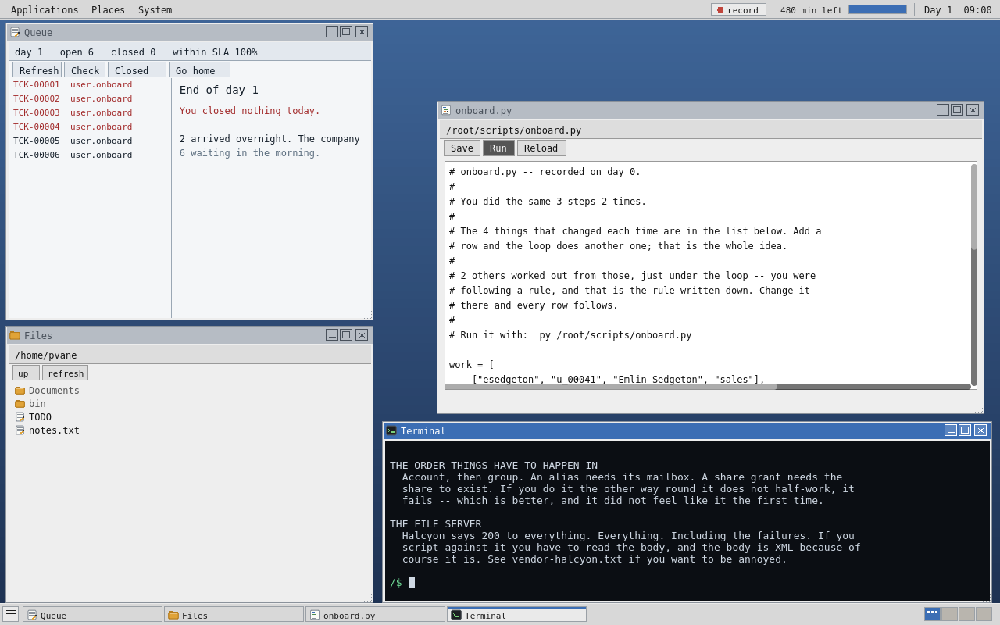

# RUNBOOK

Factorio's ratchet, applied to IT operations. You start clicking. You end up
with an orchestrator. You win by going on vacation.

The design is in [`handoff.md`](handoff.md) and it is the authority. Anything
in this file that disagrees with it is stale, and the handoff wins.

## Where this is

**M0–M3, M5, M6, M7.** The game, with a desktop on it.



Everything headless: an org that grows, tickets
that close only by state verification, three appliances driven from specs,
exceptions that ramp, capacity and provisioning, and the vacation.

`make check` runs six gates in about eight seconds, and the last of them is
the win condition:

```
vacation: 7 days, 4197 users, nobody watching. Day 77.
vacation: PASS  100% of tickets resolved within SLA (want 99%)
vacation: PASS  queue 0 deep at the start, 0 at the end
vacation: PASS  no service went over nominal capacity
vacation: the company ran itself for 7 days. Go on holiday.
```

## The person who had this job before you

`/home/pvane` is a home directory you can reconstruct somebody from: a work
diary that runs March to July and gets shorter as it goes, a handover, a
vendor thread with Halcyon support that never once answers the question, a
shell history, and an onboarding script abandoned three-quarters finished
with a README saying exactly what is wrong with it.

It is also the tutorial. The naming convention is in `notes.txt` because that
is where somebody doing this job would have written it down. The ordering
rules are there too. And `bin/README` lists the three things wrong with the
half-finished script — no collision check, no verification, no retry — which
are precisely the three things Act II is about.

> *The day I wrote the loop was the best day I had here. I should have had it
> in week one. Everything after that was me not fixing a script I already
> knew was wrong, because there was never a morning free to do it, because
> the script was not fixed.*

Every technical sentence in it is true of this world and was checked by
running it. A player who reads a machine and is lied to never reads anything
again.

## The machine

Under the desktop is a whole computer: **an RV64IM emulator running a real
kernel, a real disk, a real package database and a real `/bin/sh`**, lifted
from `~/NOMINAL` and compiled unchanged against a shim (`machine/nom.h`). The
programs are real RISC-V binaries — the boot loads them off the disk and
executes them instruction by instruction.

That is decision 13, the moat: *no other game in this space has a real
interpreter on a real machine.* A script here is not a game feature with a
syntax; it is a file on a disk, run by a shell, on a CPU. You can `cat` it,
`cp` it, break it and fix it, and everything you learn doing that is true of
every Unix box you will ever touch.

The bridge between the machine and the game is **one syscall and one program**:

```sh
$ rb ticket.list open
$ for t in TCK-00001 TCK-00002; do rb ticket.check $t; done
$ echo 'rb api.call directory_01 list_accounts' > /root/onboard
$ /root/onboard
```

`/bin/rb` speaks the *same protocol* as the desktop's forms, the socket and
the reference agent. Anything the player can automate, the game can test.

**§16's first open question — "does the emulated interpreter perform?" — is
now measured rather than guessed:**

```
machine:  91 ms to install and boot an RV64IM machine
machine:  3.61 ms per `rb` call typed at a prompt
machine:  0.41 ms per `rb` call inside a script loop
machine:  ~2439 calls/second scripted, so a 6,000-call Act III day costs ~2.5 s
```

The Lua fallback is not needed. `make machine` re-runs the measurement.

## Scripting

Two layers, both on the machine, both real.

**The shell** is bash-shaped: `for … do … done`, variables, `$(…)`, pipelines,
redirection, `&&`/`||`, globbing, quoting — and scripts in files.

`/root/examples/selftest.py` is 71 assertions over arithmetic, comparison,
strings, lists, dicts, control flow, functions and recursion, and it runs in
`make machine` — because "the interpreter is broken" is something a player
experiences as *"I cannot program"*, and that is the one conclusion this game
must never cause. `selftest.sh` does the same for the shell.

**`/bin/py` is a Python subset** — indentation, `if`/`elif`/`else`, `while`,
`for`/`in`, `def`/`return`, integers, strings, lists and dicts. It is
NOMINAL's lexer, compiler and bytecode VM compiled for RISC-V, so a script is
lexed, compiled and executed *by a 43 KB program on the disk*, on the emulated
CPU. That is decision 14 (Python, because the audience knows it) landing on
decision 13 (it runs on the machine).

There is no floating point, because [the CPU has none by
design](machine/cpu.h) — integers, strings, lists and dicts. Nobody
onboarding four hundred people needs a cosine.

```python
# /root/examples/onboard.py -- shipped on the disk, and it works
for line in lines(api("ticket.list open 40")):
    t = json(line)
    u = json(api("user.get " + t["ref"]))
    login = lower(sub(u["given"], 0, 1)) + lower(u["family"])
    ...
    if find(api("ticket.check " + t["id"]), " passes") >= 0:
        print("done", t["id"], login)
```

That script closes the whole queue, and the world records it as done **by a
script**. Its comments name the three things it does wrong on purpose — no
retry, no verification, no exceptions — because those three *are* Act II.

**Both performance questions are measured, not guessed:**

```
machine:  0.42 ms per API call from a shell loop  (~2,400/second)
machine:  0.07 ms per API call from a py script   (~15,000/second)
```

The interpreter is *faster* than shell+`rb`, because it does not spawn a
process per call. A 6,000-call Act III day costs under half a second.

## The macro recorder

Decision 15 calls this *"the single most important accessibility feature in
the game"*, and the goal it serves is **making programmers out of regular
people** — not attracting programmers to the game. Those are different
products.

There is a **record** button in the panel from the first morning. Press it, do
a job the way you normally would — fill in the forms, click the buttons — and
press it again. It does not record keystrokes and it does not emit a macro: it
watched the API calls your clicking produced (which is all your clicking ever
*was*), and it writes them out as a Python script that **opens in an editor
with a Run button next to it.**

Do one person and you get lines you can read. Do **two** and it notices:

```python
# You did the same 3 steps 2 times.
#
# The 4 things that changed each time are in the list below. Add a
# row and the loop does another one; that is the whole idea.
#
# 2 others worked out from those, just under the loop -- you were
# following a rule, and that is the rule written down.

work = [
    ["esedgeton", "u_00041", "Emlin Sedgeton", "sales"],
    ["sharrcroft", "u_00042", "Sten Harrcroft", "support"],
]

for row in work:
    login = row[0]
    user_ref = row[1]
    display_name = row[2]
    dept = row[3]
    group = "dept-" + dept
    address = login + "@harbrook.example"

    api("api.call directory_01 create_account login=" + login + ...)
```

Nobody is taught what a variable is. They are shown one holding their own
work, with their own name in it — and `group = "dept-" + dept` is the rule
they were already following, written down.

The gate records a job through the UI, saves the script to the machine, runs
it, and checks the account really exists with the right name. A recorder whose
output does not execute is a demo.

## The desktop

A MATE-shaped desktop environment, lifted in palette, icon set, font and
window-manager behaviour from `~/NOMINAL/game/scripts/de.gd`, which had
already been built and already been argued about.

Applications / Places / System across the top, the in-game clock and the day
budget in the notification area, a window list and workspace pager along the
bottom, three-button decorations, free-floating windows you drag and resize.
Places lists the appliances, discovered from the API — buy a second mail
server and it appears in the menu.

**Every appliance's web UI is generated** from its spec, themed per vendor
(decision 6, §14). Veridian's is roomy and cool; Halcyon's is cramped and
beige and answers in XML. There is no hand-built screen for any appliance, and
`--health` refuses a form that offers a field its endpoint will not accept.

**Fields are typed**, so the generated forms offer choices rather than blank
boxes: an enum lists its values, a `ref` lists what is actually in the
collection it points at, and a key field on an edit-or-delete endpoint lists
the records that exist. You pick an account to edit; you never have to have
memorised its login. A new appliance gets all of that for free, and the API is
unchanged — a picker sends the same `field=value` a box would.

**Two clipboards, X11's two.** Drag over text and it is in PRIMARY with no
keystroke; middle-click pastes it. Ctrl-Shift-C and Ctrl-Shift-V use the
system clipboard. They are independent, so a login can sit in one while a path
sits in the other. Where the platform has a real PRIMARY, it *is* the system's
— select in the terminal and middle-click into a browser.

**The terminal is NOMINAL's terminal**: one buffer, the line you are typing
drawn where it will land, history, reverse-i-search, and Tab completion driven
by what the API says exists — the verbs `help` advertises, the appliances
installed, the endpoints each one has.

**There is no Resolve button** and there is never going to be one. The queue
has a Check button, which asks the world; every failing check says why.

And there is Solitaire in the Applications menu, along with nine other things
lifted whole from NOMINAL. Not a joke: every corporate desktop ever issued had
those on it, and this game is won by **going on holiday**. The moment a player
leaves a script running, opens Solitaire, and watches the queue empty itself
in the window behind it is the moment the whole design is arguing for.

```sh
make run        # build the binding and play
make shot       # render docs/desk.png without borrowing a screen
make client     # the client gate
```

## Playtesting Act I

`make run`. You are the entire IT department of Harbrook Industries. Forty
people work here; four more started this morning and have nothing.

1. **Queue** opens on its own. Click a ticket. Press **Check** — every
   acceptance test, and for the ones that fail, why.
2. The ticket names its subject (`u_00041`) and their department. The
   convention is in check two: first initial plus family name, a number only
   if it collided.
3. Open **directory_01**, **mail_01** and **fileserver_01** from *Places*.
   Fill in the forms. Each submission costs two in-game minutes off the 480
   in the top-right.
4. Press **Check** again. When the world agrees, the ticket closes itself.
   There is no Resolve button.
5. **Go home** ends the day. Tomorrow brings more, and whatever you did not
   finish is still there.

Do that four times and you will have spent about an hour of the working day.
Then imagine forty.

**The question a playtest answers, which no gate can:** is that hour
*pleasant*? If Act I reads as tedious, the design's own guidance is that it is
too **long**, not too slow — the day budget, the wall and the ticket rate are
all one constant each, and `--play` will re-tune around them.

**What is not there yet.** Act II proper is M4. The Terminal is in
*Applications* and everything the forms do goes through it, so you can already
script by hand — but the ramp from clicking to scripting (the macro recorder,
and a real interpreter on an emulated machine) is the next milestone and the
whole bet.

The org has forty people, fully provisioned across a directory, a mail server
and a file server — all of it there before the player arrives, all of it
attributed to nobody. It grows about 6% a day. Every hire raises an onboarding
ticket with seven acceptance checks, and **the only way to close one is to
make the checks true**. There is no "mark as done" verb; `--health` asserts
by name that there never will be.

A **person and their account are different objects**, and that is the game. A
`User` is what HR knows: hired, into a department, on a day. Their login,
groups, mailbox, home folder and share access live in appliances, and putting
them there is the work.

```
$ ./build/runbook --exec 'ticket.check TCK-00007'
+OK TCK-00007 does not pass yet
PASS account_exists            They have an account in the directory of record.
PASS login_follows_convention  The login is first initial plus family name...
     account_active            The account is active, not left in whatever
                               state it was created in.  -- status is
                               contractor, not active
PASS in_department_group       They are in their department's group.
...
```

That one is a returning contractor. Their account already existed, so a script
that relies on `create` being idempotent gets a 200 and moves on, leaving
somebody whose account exists and does not work. Idempotency is not enough;
you have to reconcile. There is nothing to *diagnose* — the ticket said
`"rehire":"yes"` from the moment it opened — there is something to *handle*,
and that is the difference the whole design rests on (§2).

## Build and check

```sh
make          # build/runbook — one binary, no runtime dependencies
make check    # both gates: --health, then determinism
```

`make check` is the M0 deliverable. It must be green before anything from M1
starts.

## Running it

Every mode drives the same API; there is no back door into the model.

```sh
./build/runbook                          # commands on stdin
./build/runbook --serve                  # 127.0.0.1:7711, then telnet in
./build/runbook --exec 'world.info'
./build/runbook --seed 7 --days 90 --out world.json
```

Type `help` for the verbs. Every response ends with a lone `.` on its own
line, so a dumb client can find the end without parsing the body.

## The gates

| Gate | What it asserts | State |
|---|---|---|
| `--health` | Specs load and validate; a pristine org boots with its directory intact and following its own naming convention; every endpoint in every spec responds; idempotency, ordering and spent logins behave; every verb `help` advertises dispatches | live |
| determinism | Same seed reproduces byte-for-byte over 120 simulated days; a different seed diverges; `-O0` and `-O2` agree; the Linux and Windows builds agree | live |
| `--mancheck` | Every example in every generated manual executes against a live world; every endpoint is documented | live |
| `--play` | A reference agent plays through the acts over the API, and must keep up: ≤2% of tickets failed, ≥95% within SLA. Reports per-act wall time and where it stalled | live |
| `--naive-gate` | §8's degeneracy band, over three seeds: a bot that does not branch must fail ≤5% of tickets at the Act I wall and ≥35% by the end of Act II | live |
| `--vacation N` | The win condition: N simulated days at 4,000 users with nobody watching — ≥99% within SLA, queue no deeper at the end, no service over nominal for more than 30 in-game minutes. Failing is diagnostic: it names the ticket types your systems did not handle and the service that fell over | live |

`--health` prints `PENDING` lines for the parts of its handoff definition that
have nothing to check yet. That is on purpose: a check with nothing to check
reports green, and a suite that is green for that reason is worse than no
suite.

The Windows half of the determinism gate needs `mingw-w64` and a 64-bit wine
prefix. Without them it prints `SKIP` and the command to fix it.

## Layout

```
core/rb.h        limits, buffers, the RNG, the hash, provenance
core/util.c      lifted from NOMINAL, trimmed
core/yaml.h/.c   the subset of YAML the specs are written in
core/spec.h/.c   appliance specs: load, and above all validate
core/appl.h/.c   instances, records, and calling an endpoint
core/world.h/.c  the org: people, clock, growth, appliances
core/proto.h/.c  the API — the only way anything talks to the world
core/serve.c     the local socket; lifted from NOMINAL's net.c
core/health.c    the health gate
core/mancheck.c  every documented example, executed
core/main.c      the command line; the only file that knows one exists
specs/*.yaml     the appliance library; embedded by tools/mkspecs.sh
```

The core is a library. `main.c` is the only file that knows about a command
line, so everything else links unchanged into the GDExtension when the client
arrives at M3. The world lives in the model; Godot will be a view of it.

## Writing an appliance

One YAML file. It drives the endpoints, the web forms, the manual and the
examples the gate executes — one source, so they cannot disagree.

```sh
$EDITOR specs/my_appliance.yaml
./build/runbook --specs specs/ --mancheck     # iterate without a rebuild
./tools/mkspecs.sh && make check              # embed it and check it in
```

Endpoints declare an operation (`list`, `get`, `create`, `update`, `delete`)
over a named collection, plus the things that make scripting them a game:
`idempotent_on`, `references`, `failure_modes`, `latency_ms`. `--health`
refuses a spec that documents an endpoint it cannot dispatch, a form that
offers a field its endpoint will not take, or a model claiming an API from a
vendor that does not sell one.

## The balance harness

Nothing in this game is tuned by argument. The growth model, the exception
ramp, the failure rates and the size of the surname table were all set by
running `--play` and `--naive-gate` and reading the numbers:

```sh
make play     # a competent script must keep up
make naive    # an incompetent one must not
```

Between them they found a runaway follow-up loop that grew the queue 1.4× a
day regardless of play, a use-after-free that only appeared once the queue got
big, and a collision space that was three times smaller than it looked. Every
constant they settled carries a comment saying so.

## Writing a ticket type

One YAML file, like an appliance. Acceptance checks are declarative predicates
over appliance collections, validated at load against the appliance specs — a
ticket whose acceptance names a collection no appliance has could never close,
and that is caught at startup rather than in a playtest.

```yaml
  - id: in_second_group
    check: exists
    when: also_dept          # only for tickets carrying that field
    appliance: directory     # any instance of the kind, not a named one
    collection: memberships
    where: { login: "{account.login}", group: "dept-{also_dept}" }
    doc: "They are also in the second department they were hired into."
```

`{account.login}` is bound by an earlier check, which is how acceptance can
verify work whose exact shape was the player's decision. A check that does not
apply reports `n/a`, never `PASS`.

## Act III

Past about 600 users per appliance an instance goes over nominal and every
call to it gets slower in proportion — and slow calls eat the day budget,
which is the only currency in the game. The world raises a `service.capacity`
ticket; `appl.install` racks another box, and it costs forty in-game minutes
whether a person or a script asks for it.

**Placement and replica count are the decisions, and there is no cabling.**
Nothing else scales: acceptance checks search the whole service rather than a
named appliance, so where you put things is yours to get right. Reference data
(groups, shares) replicates to every instance, because making the player
configure each new box is config management and that is the sequel. Identity
does not shard — `scope: service` on a collection means its key must be free
across every instance, since you can shard storage but never names.

## What M3 does next

The Godot client: a window-manager shell, a generic form renderer driven by
`appl.forms`, per-vendor themes. Everything it needs is already served over
the API, because the client is a client (decision 7). M3 and M4 are the two
milestones that need a human at a keyboard — the questions they answer are
*is Act I pleasant* and *does the relief land*, and no gate can answer those.
